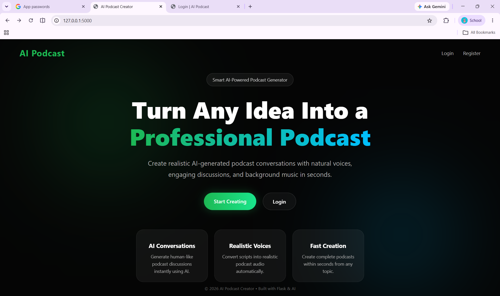
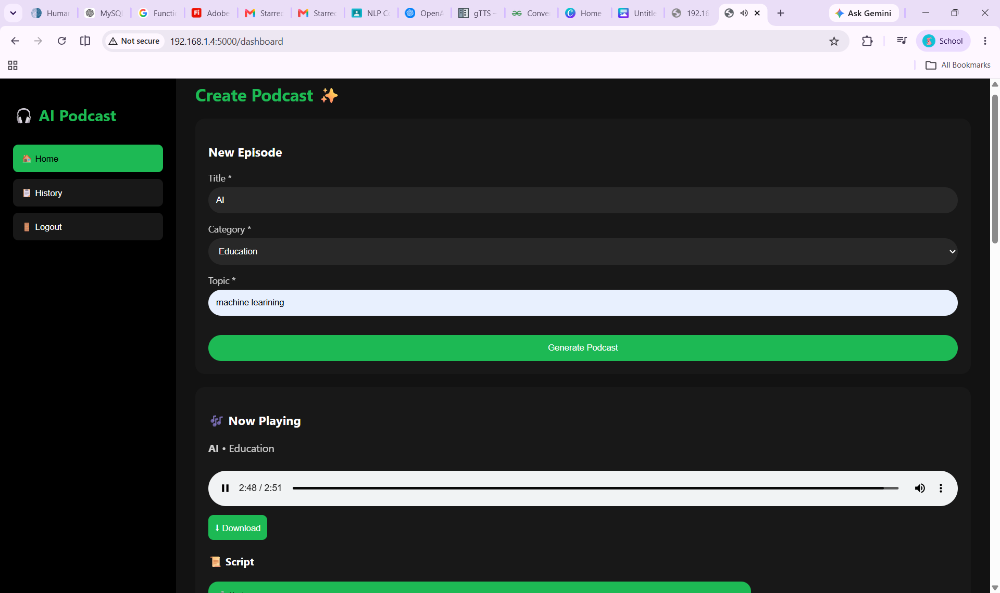
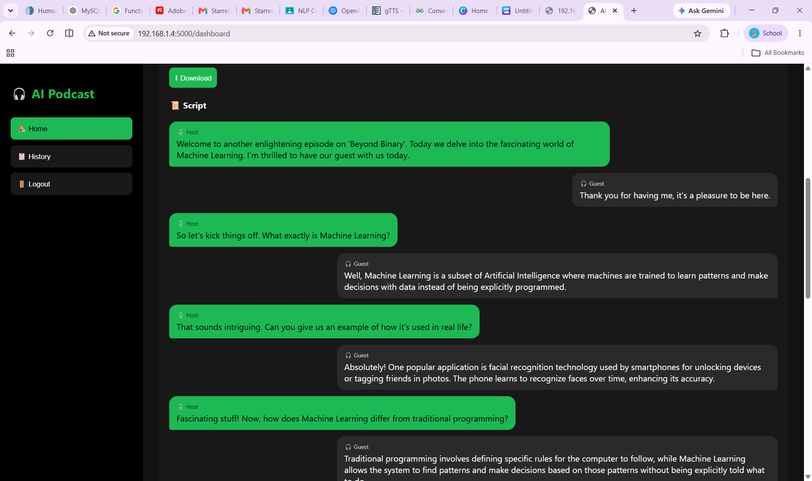

**AI Podcast Creator**

An AI-powered full-stack web application that generates podcast scripts using Ollama LLM models and converts them into audio using Text-to-Speech (TTS). The system includes authentication, OTP verification, and a complete frontend-backend integration.

**Features**

- AI podcast script generation using Ollama
- Text-to-Speech (TTS) audio generation
- User authentication system (JWT / session-based)
- OTP verification for secure login/signup
- Podcast history storage
- Full-stack web application (Frontend + Backend)
- Fast Flask-based backend API
- Audio file management system

**Tech Stack**

- **Backend :**
Flask (Python)
Ollama (LLM integration)
SQLite / MySQL (Database)
JWT Authentication
OTP System (Email/SMS based)
TTS (pyttsx3 / gTTS)
- **Frontend :**
HTML, CSS, JavaScript
Flask Templates / Custom frontend.py
- **Tools :**
Postman (API testing)
Git & GitHub

**Ollama AI Integration**

This project uses Ollama to generate intelligent podcast scripts locally.

 **Supported Models:**

- LLaMA 3
- Mistral
- Gemma

**Workflow:**

- User enters a topic
- Backend sends prompt to Ollama
- Ollama generates podcast script
- Script is processed and stored
- TTS converts script into audio

**Project Structure**

```text
project-root/
│
├── backend/
│   ├── __init__.py
│   ├── app.py              # Main Flask app
│   ├── auth.py             # Login / Register / Authentication
│   ├── db.py               # Database connection
│   ├── otp.py              # OTP verification system
│   ├── podcast.py          # Ollama script generation
│   ├── tts.py              # Text-to-speech conversion
│   ├── test.py             # Testing APIs
│   ├── requirements.txt
│   └── podcast_audio/      # Generated podcast audio files
│
├── frontend/
│   ├── frontend.py         # Frontend routes/UI handling
│   ├── templates/          # HTML templates
│   ├── static/             # CSS, JavaScript, images
│   └── pages/              # Additional pages/components
│
└── README.md
```
**Installation & Setup**

## ⚙️ Installation & Setup

### 1. Clone Repository

```bash
git clone https://github.com/your-username/ai_podcast_creator.git
cd ai_podcast_creator
```

### 2. Create Virtual Environment

```bash
python -m venv venv
```

Activate virtual environment:

**Windows**

```bash
venv\Scripts\activate
```

**Mac/Linux**

```bash
source venv/bin/activate
```

### 3. Install Dependencies

```bash
pip install -r requirements.txt
```

### 4. Install Ollama

Download and install Ollama:

https://ollama.com

Run the model:

```bash
ollama run llama3
```

### 5. Run Backend

```bash
python backend/app.py
```

### 6. Run Frontend

```bash
python frontend/frontend.py
```

---

## 📡 API Endpoints

### 🔐 Authentication

#### Register User

```http
POST /register
```

#### Login User

```http
POST /login
```

#### OTP Verification

```http
POST /verify-otp
```

---

### 🎙️ Podcast

#### Generate Podcast Script

```http
POST /generate
```

Request Body:

```json
{
    "topic": "Artificial Intelligence in 2026"
}
```

Response:

```json
{
    "script": "Generated podcast script...",
    "audio_file": "podcast_audio/output.mp3"
}
```

System Architecture
```text
User → Frontend UI → Flask Backend → Ollama Model → Script Generation → TTS → Audio File → User
```
**Key Modules Explained**

🔹 auth.py

    -> Handles login, registration, and JWT authentication.

🔹 otp.py

    -> Manages OTP generation and verification for secure access.

🔹 podcast.py

    -> Connects with Ollama LLM to generate podcast scripts.

🔹 tts.py

     -> Converts generated text into speech audio.

🔹 db.py

    -> Handles database connections and queries.

**Future Improvements**

-  Multi-voice podcast system
-  Multi-language support
-  Cloud deployment (AWS / Render)
-  Mobile application version
-  Real-time audio streaming
-  Better UI dashboard
-  
**⚠️ Limitations**
- Ollama must run locally
- Large script generation may take time
- No cloud audio storage yet
- Limited voice customization
- OTP requires external service setup

### Home Page


### Podcast Generation


### Generated Output

